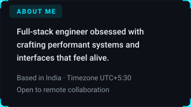
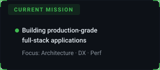
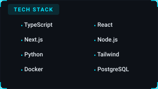
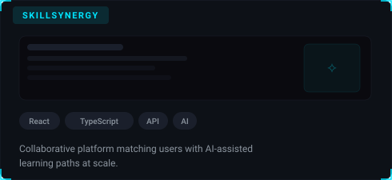
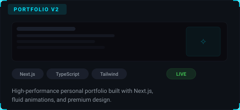

<!-- ═══════════════════════════════════════════════════════ -->
<!--  SECTION 1 — HERO                                      -->
<!-- ═══════════════════════════════════════════════════════ -->

<!-- ═══════════════════════════════════════════════════════ -->
<!--  SECTION 2 — THREE-COLUMN DASHBOARD                    -->
<!-- ═══════════════════════════════════════════════════════ -->

<table width="100%">
<tr>

<!-- ── Column 1: Identity ──────────────────────────────── -->
<td width="33%" valign="top">
  
    
  
    
  
</td>

<!-- ── Column 2: Engineering ───────────────────────────── -->
<td width="33%" valign="top">
  
    
  
    
  
</td>

<!-- ── Column 3: GitHub Dashboard ──────────────────────── -->
<td width="33%" valign="top">
  
    
  
    
  
</td>

</tr>
</table>

<!-- ═══════════════════════════════════════════════════════ -->
<!--  SECTION 3 — FEATURED PROJECTS GRID                    -->
<!-- ═══════════════════════════════════════════════════════ -->

<table width="100%">
<tr>
  <td width="50%">
    
  </td>
  <td width="50%">
    
  </td>
</tr>
<tr>
  <td width="50%">
    
  </td>
  <td width="50%">
    
  </td>
</tr>
</table>

<!-- ═══════════════════════════════════════════════════════ -->
<!--  SECTION 5 — FOOTER                                    -->
<!-- ═══════════════════════════════════════════════════════ -->

 

  

