<!-- ═══════════════════════════════════════════════════════ -->
<!--  1. HERO BANNER                                        -->
<!-- ═══════════════════════════════════════════════════════ -->

  

<!-- ═══════════════════════════════════════════════════════ -->
<!--  2. METRICS & TELEMETRY DASHBOARD                      -->
<!-- ═══════════════════════════════════════════════════════ -->

  

<!-- ═══════════════════════════════════════════════════════ -->
<!--  3. CONTRIBUTION SNAKE ANIMATION                       -->
<!-- ═══════════════════════════════════════════════════════ -->

  <picture>
    <source media="(prefers-color-scheme: dark)" srcset="https://raw.githubusercontent.com/Psyodrz/Psyodrz/output/github-snake-dark.svg" />
    <source media="(prefers-color-scheme: light)" srcset="https://raw.githubusercontent.com/Psyodrz/Psyodrz/output/github-snake.svg" />
    
  </picture>

 

<!-- ═══════════════════════════════════════════════════════ -->
<!--  4. LIVE GITHUB STATS & STREAK                         -->
<!-- ═══════════════════════════════════════════════════════ -->

  
  

 

<!-- ═══════════════════════════════════════════════════════ -->
<!--  5. TECH MATRIX & SKILLS MATRIX                        -->
<!-- ═══════════════════════════════════════════════════════ -->

  

<!-- ═══════════════════════════════════════════════════════ -->
<!--  6. FEATURED PROJECTS SHOWCASE                         -->
<!-- ═══════════════════════════════════════════════════════ -->

  

  

  

  

<!-- ═══════════════════════════════════════════════════════ -->
<!--  7. LIVE SPOTIFY & RECENT ACTIVITY                     -->
<!-- ═══════════════════════════════════════════════════════ -->

  

### Recent Engineering Activity

<!-- REPOS:START -->

<i>Repository list refreshes daily via GitHub Actions.</i>

<!-- REPOS:END -->

  

<!-- ═══════════════════════════════════════════════════════ -->
<!--  8. FOOTER & SOCIAL CONTACTS                           -->
<!-- ═══════════════════════════════════════════════════════ -->

  

  
  
  

 

